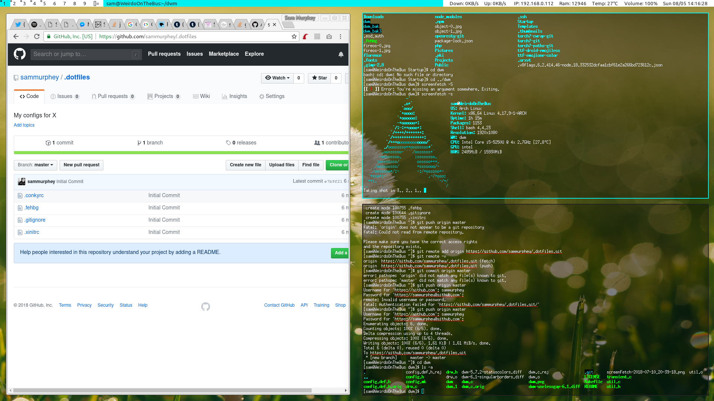

Chlorophyll - a DWM fork
========================

Final result when running with my [.dotfiles](https://github.com/sammurphey/.dotfiles)

[Wallpaper](https://unsplash.com/photos/XxvXRmsH860) by [Aaron 
Burden](https://unsplash.com/@aaronburden) on [Unsplash](https://unsplash.com/)

////////

I don't recommend using this build as is for your main wm as it's not set up to 
recieve updates from DWM. Instead please install a up-to-date version of [DWM 
from Suckless](https://dwm.suckless.org/) and then copy my [config.h file] into 
it's installation directory. After updating the configs you'll need to run `make` 
again to compile with the new settings.
